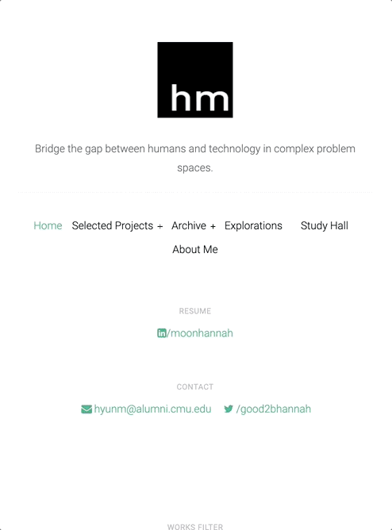

# Hannah's Old Portfolio

## 📌 This portfolio showcases years of my product design experience.

- Mapping out the architecture
- Providing good enough interaction for users
- Ensuring smooth transitions between sections
  
## 📖 Time and link

> 📆 Duration of work: December 2020 ~ present </br>
> 🔗 Live link: [Portfolio](https://hannah-moon.github.io/home.html) </br>

## ✔️ Tools 

```
html(5.1.1),css(3.1.1), js(ES6)
```


## ✔️ Memo

### Landing Page
<div align="center">


### Media integration
<div align="center">


### Skills
<div align="center">


### Different screen size

| Mobile                                                                                                     | 
| ---------------------------------------------------------------------------------------------------------- |
|  |
